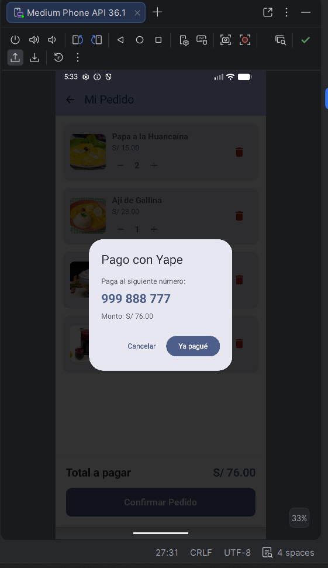
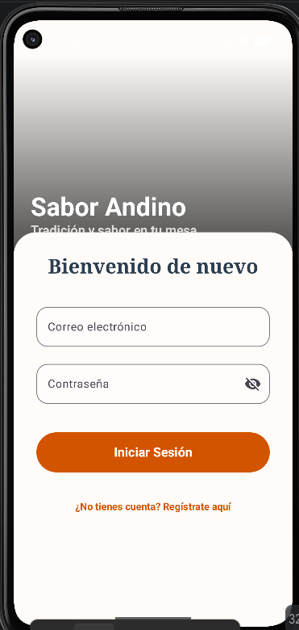
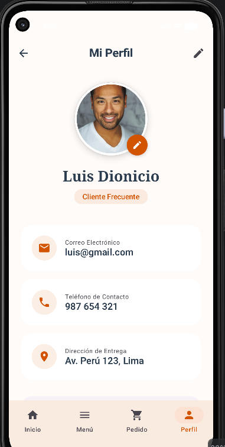
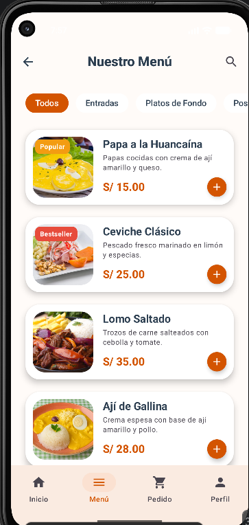
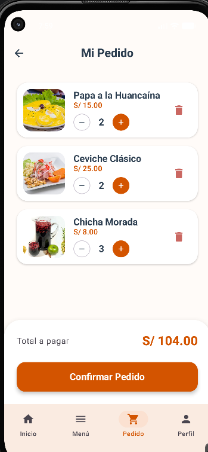
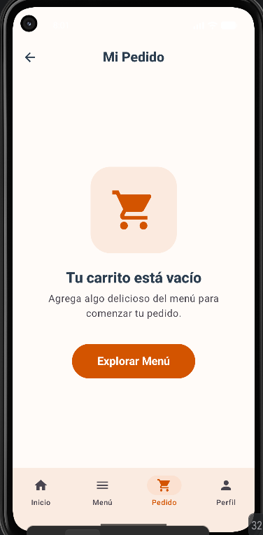
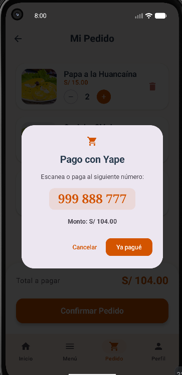
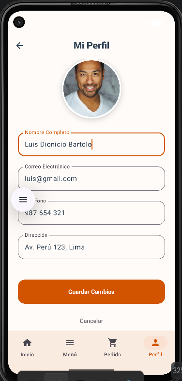
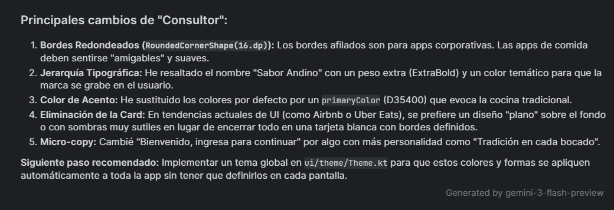

## Documentación del proceso acerca de nuestro proyecto Sabor Andino.
## Captura de nuestro Login antes de la mejora

## Captura de nuestro Login despues de la mejora

## Captura de nuestro Dashboard antes de la mejora

## Captura de nuestro Dashboard despues de la mejora

## Captura de nuestro Menú antes de la mejora
**Lista de nuestro Menú**

**Detalle del Menú**

## Captura de nuestro Menú despues de la mejora

## Captura de nuestro Pedido antes de la mejora
**Detalle de nuestro pedido**

**Confirmación del pedido y con qué pagarlo**

## Captura de nuestro Pedido despues de la mejora

## Captura de nuestro Perfil antes de la mejora
**Perfil que tenemos por default**

**Configuración del Perfil**

**Perfil configurado**

## Captura de nuestro Perfil despues de la mejora

##### login actualizado

##### Perfil Home nuevo

##### Menu actualizado

##### Lista de agregados de menu nuevo

##### Lista de carrito vacio actualizado

##### Pago Finalizado nuevo

##### Perfilhome nuevo

#### Editar perfil nuevo

***
## Prompt

##### Análisis de la IA GEMENI

ç

#### Los 3 pronst utilizados:

1- 
Quiero que mejores completamente el diseño visual de mi aplicación móvil de restaurante
desarrollada en Android Studio,manteniendo intactas todas sus funcionalidades actuales.
No deseo cambios en la lógica del sistema,navegación, estructura de pantallas ni procesos
ya implementados; únicamente busco una mejora profunda en la apariencia, presentación y
experiencia visual de la aplicación para que luzca más profesional, moderna y alineada con
una app comercial real de restaurantes. Es importante que realices una auditoría visual sobre
las pantallas principales, especialmente en el login, menú principal, perfil de usuario y sección
de pedidos o carrito. Cada una de estas vistas debe optimizarse para ofrecer una mejor
experiencia de usuario, aplicando principios de UI/UX más sólidos. Se debe mejorar notablemente la
jerarquía visual mediante el uso de tipografías más modernas, tamaños más adecuados, mejores pesos
visuales,títulos más llamativos y una distribución más ordenada de los elementos para que la aplicación
sea más intuitiva, legible y visualmente atractiva.

2- 
También necesito una renovación de componentes clave como botones,
barras inferiores o footers de navegación, tarjetas de productos y
elementos interactivos. Los botones deben verse más elegantes, con bordes
redondeados, mejor espaciado, colores más coherentes y una apariencia más formal.
El footer o navegación inferior debe sentirse más moderna y
consistente con aplicaciones profesionales, mientras que las tarjetas de platos
o productos deben incorporar sombras, elevación, profundidad visual y detalles
adicionales como indicadoresde “Más vendido”, “Nuevo” o “Popular”, con el objetivo
de hacer la interfaz más dinámica y comercial.

La pantalla de inicio de sesión debe rediseñarse para ofrecer una experiencia más
atractiva, incorporando una mejor distribución del espacio, posiblemente una imagen
de cabecera o banner relacionado con restaurantes, y una estructura visual más limpia
y moderna. Asimismo, la experiencia en estados vacíos debe ser mejorada, por ejemplo
cuando el carrito o historial de pedidos no tenga elementos, mostrando diseños más
amigables y visualmente trabajados en lugar de espacios vacíos simples.

3-
Además, deseo que se integren transiciones o animaciones suaves entre pantallas
para mejorar la sensación de fluidez y modernidad de la aplicación.
Estas mejoras deben ser sutiles pero efectivas, aportando una experiencia más
pulida sin afectar el rendimiento ni alterar el funcionamiento base del proyecto.
En la sección de perfil, quiero una mejora visual importante incluyendo una imagen de
usuario profesional generada mediante IA o una imagen aleatoria realista
obtenida mediante URL funcional integrada directamente en el código. Esta imagen debe
representar mejor al usuario autenticado y aportar una apariencia
más personalizada, moderna y formal dentro del perfil.

